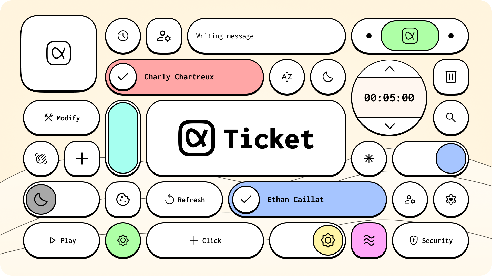
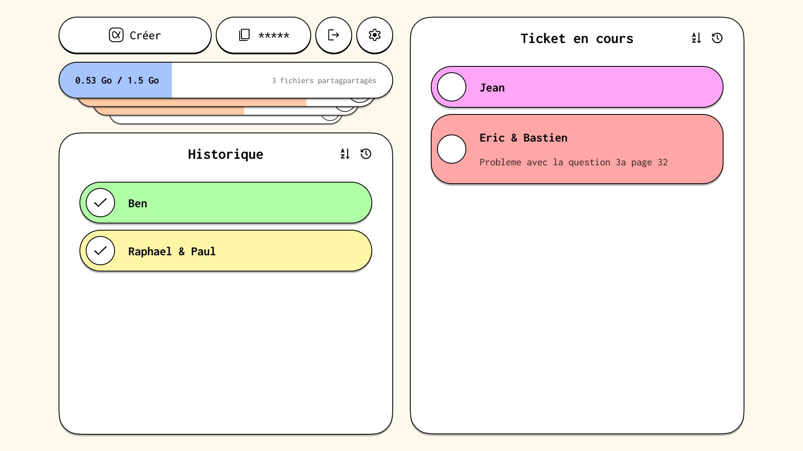

<div align="center">



**Un projet réalisé par Charly Chartreux & Ethan Caillat**<br>

Code source :🄯 (copy left)

Design & Contenus : BY-NC-SA


<br/>

[Report Bug](https://github.com/votre-pseudo/votre-repo/issues) · [Request Feature](https://github.com/votre-pseudo/votre-repo/issues)

</div>

---

## 💡 L'idée

**Ticket** est un outil web conçu pour simplifier radicalement la création de demandes d'assistance. Notre philosophie est simple : **pas de compte utilisateur**. Toute l'expérience tourne autour de groupes privés accessibles via un code unique.

| Fonctionnement Intuitif | Gestion Avancée |
| :--- | :--- |
| ⚡ **Instantané** : Un créateur lance un groupe et devient **Owner**. | 👑 **Contrôle** : Le Owner gère les membres et tickets. |
| 🔗 **Accès Facile** : Code unique ou lien rapide pour rejoindre. | 📂 **Partage XXL** : Envoi de fichiers jusqu'à **1,5 Go**. |
| 📢 **Visibilité** : Liste de tickets commune visible par tous. | 🚮 **Nettoyage** : Groupes supprimés une fois l'utilité passée. |

<br/>

## 🔒 Confidentialité et Sécurité (RGPD)

Nous avons placé la sécurité des données au centre de l'architecture. **Nous ne conservons rien.**

> ⏱️ **Cycle de vie court** : Toutes les données sont automatiquement et **définitivement supprimées après 3 heures**.

| 🔐 Chiffrement | 🇪🇺 Hébergement | 🛡️ Éthique |
| :--- | :--- | :--- |
| Chiffrement de **bout en bout** (client-serveur-client) via une clé unique par groupe. | Stockage temporaire exclusivement sur des **serveurs Européens**. | Aucune donnée utilisée à des fins commerciales. |

---

## 🎨 Interface et Expérience

<table border="0">
  <tr>
    <td width="50%" valign="top">
      <h3>Une identité visuelle forte</h3>
      <p>Le design de Ticket est au service de l'utilisateur. Nous avons adopté une <b>direction artistique marquée</b> pour une clarté immédiate.</p>
      <br/>
      <ul>
        <li>✨ <b>Animations travaillées</b> pour fluidifier l'expérience.</li>
        <li>🌙 <b>Dark Mode complet</b> pour le confort visuel.</li>
        <li>🎨 <b>Palette de couleurs</b> distinctive et informative.</li>
        <li>👁️ <b>Icônes Material</b> pour une accessibilité maximale.</li>
      </ul>
    </td>
    <td width="50%">
      
    </td>
  </tr>
</table>

---

## 🚀 Fonctionnalités Clés

Ticket regorge d'outils pensés pour l'efficacité :

* 🎨 **Personnalisation** : Choix de la couleur des tickets pour l'organisation visuelle.
* 🤬 **Modération auto** : Filtrage automatique des mots interdits.
* 🚫 **Limitation** : Le Owner peut définir un nombre max de tickets.
* 📎 **Partage natif** : Fichiers et liens intégrés sans friction.

---

## 🛠️ Open Source & Contribution

Ticket est un projet communautaire et transparent. L'Open Source permet à chacun d'auditer notre code ou de créer sa propre instance.

<div align="center">

| Vous êtes développeur ? | Vous voulez héberger ? |
| :---: | :---: |
| Les **Pull Requests** sont les bienvenues ! | Il est possible de **créer son propre hébergeur** pour déployer une instance privée. |

</div>

### Installation (Développement)

```bash
# Clonez le repo
git clone [https://github.com/votre-pseudo/ticket.git](https://github.com/votre-pseudo/ticket.git)

# Installez les dépendances
npm install

# Lancez le projet
npm run dev
